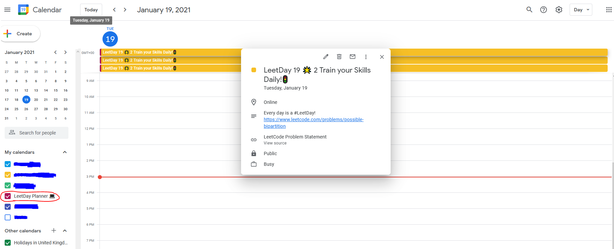

#LeetDay Calendar
A calendar that assigns you new, random LeetCode questions everyday!

<a align="center" href="https://calendar.google.com/calendar/u/0?cid=OWhiYmY5c2pucWxzMG1maGVwOWRlZDVwZDRAZ3JvdXAuY2FsZW5kYXIuZ29vZ2xlLmNvbQ">click me to join the calendar!</a>

### Anyone Can Join the Calendar! 🏝️
If you just want to use the calendar and receive new questions on a daily basis, click the [invite link here](https://calendar.google.com/calendar/u/0?cid=OWhiYmY5c2pucWxzMG1maGVwOWRlZDVwZDRAZ3JvdXAuY2FsZW5kYXIuZ29vZ2xlLmNvbQ). There are no requirements to join, everyone can be accepted!

## Project Structure
The app runs as a [Scheduled Firebase Function](https://firebase.google.com/docs/functions/schedule-functions), that is triggered once per day.
## Getting Started
If you want to play around with the project locally, you will need the following:
- A Firebase Project on the Blaze Plan. This will provide you with your **Firebase Config** used to initialise the Firebase App.
- A Google Cloud Project with the Google Calendar API enabled. The OAuth consent screen and some OAuth credentials will need to be setup. This will provide you with your **client_id**, **client_secret** and **access / refresh token**.
- A specific Google Calendar to connect to.
### Installation
1. Complete the OAuth2.0 Flow for the Calendar API to obtain your **refresh token**. [OAuth Playground](https://developers.google.com/oauthplayground/) is a good resource for 'simplying' this process.
2. Create the <code>functions/credentials</code> folder and add the following files:
   - Your firebase config as <code>config.json</code>
   - Your **client_id**, **client_secret** and **access token** and **calendar_id** all in a file called <code>calendar-config.json</code>

### Running the App
- Install firebase tools with <code>npm install -g firebase-tools</code>
- Use <code>firebase emulators:start</code> to trigger the firebase function locally, or <code>firebase deploy --only functions</code> to deploy to the cloud under your Firebase project.

## Contributing
[Samuel Sogbesan](https://www.linkedin.com/in/samuel-sogbesan/)
## License
Apache 2.0

## Contact
Email me at juwonsogbesan@gmail.com
Otherwise, you can get in touch with me on [LinkedIn](https://www.linkedin.com/in/samuel-sogbesan/)